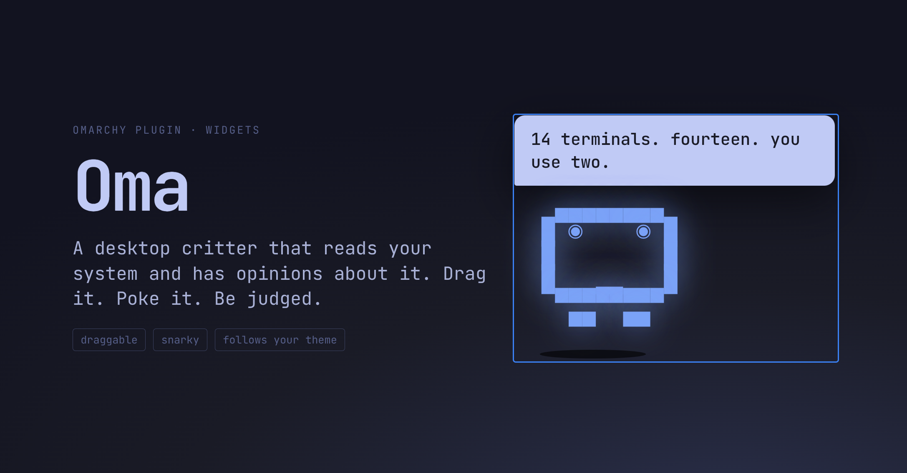

# Omabuddy

A small, mostly useless companion for [Omarchy](https://omarchy.org/). It sits
in a corner of your screen, wears your theme, and has opinions about your day.



It notices:

- **The clock.** Sleepy before eight, hyped after lunch, zen in the evening.
- **Your work streak.** Ninety minutes without a break and it starts nagging you to stand up.
- **Git.** It follows the working directory of your focused terminal. A big
  uncommitted diff makes it worry, a commit makes it proud, a push makes it
  cheer.
- **Your machine.** Pegged CPUs make it sweat, a low battery makes it panic.
- **Your calendar.** If [OmaCal](https://github.com/omacal) is installed it reads
  the same feed as the OmaCal bar widget and warns you ten minutes before a meeting.
- **Your coding agents.** Omarchy already tracks Claude Code, Codex, and
  friends. The buddy knows when an agent window is spinning, when it stops
  and wants you back, and when you are about to hit a rate limit.

Everything it says comes from `Quips.js`, a plain list of one-liners in two
voices, snarky and polite, that you can add to. If you run a local [Ollama](https://ollama.com/), it can improvise
instead.

## Install

```bash
omarchy plugin add https://github.com/wirlen/omabuddy.git --enable
```

Then restart the shell once so the panel mounts:

```bash
omarchy restart shell
```

## Using it

| Do this | It does |
| --- | --- |
| Click it | Pokes it. It says something. |
| Drag it | Moves it. It snaps to the nearest corner and remembers. |
| Scroll on it | Grows or shrinks it. The size is remembered. |
| Right-click it | Mutes or unmutes the speech bubble. |

From a terminal or a script:

```bash
omarchy-shell omabuddy say "build is green"
omarchy-shell omabuddy poke
omarchy-shell omabuddy mood proud       # any mood name from Mood.js, for 20 seconds
omarchy-shell omabuddy state            # JSON of mood, streak, and sensors
omarchy-shell omabuddy set <key> <value>   # e.g. set size 18, set tone polite
```

That `say` call is the hook point. Wire it into anything: a git post-commit
hook, a CI notifier, an Omarchy `theme-set` hook.

## Settings

Set with `omarchy-shell omabuddy set <key> <value>`, or edit the plugin's
entry in `~/.config/omarchy/shell.json`. Changes apply immediately.

| Key | Default | Meaning |
| --- | --- | --- |
| `corner` | `bottom-right` | `top-left`, `top-right`, `bottom-left`, `bottom-right` |
| `size` | `14` | Face font size in pixels, 8 to 48. Scrolling on the buddy sets this too. |
| `tone` | `snarky` | `snarky` or `polite` |
| `chattiness` | `12` | Minutes between unprompted lines |
| `muted` | `false` | Hide the speech bubble |
| `llm` | `off` | `ollama` to improvise lines with a local model |
| `ollamaUrl` | `http://localhost:11434` | Where Ollama listens |
| `ollamaModel` | `llama3.2` | Any model you have pulled |
| `probeSeconds` | `20` | How often it looks at git, battery, and load |

Example entry:

```json
{ "id": "wirlen.omabuddy", "corner": "bottom-left", "llm": "ollama", "ollamaModel": "qwen2.5:3b" }
```

## Moods

`idle`, `sleepy`, `hyped`, `stretch`, `worried`, `proud`, `shipped`, `sweaty`,
`panic`, `zen`, `meeting`, `rationed`, `cooking`, `agentDone`, `poked`, `greeting`. The rules live in `Mood.js`; the face for
each mood is a handful of numbers in the same file.

## Contributing lines

Open `Quips.js`, find the mood, add a line. Keep it short, kind, and in the
voice of a small creature who lives in a screen corner. Tokens `{repo}`,
`{branch}`, `{dirty}`, `{hour}`, `{streak}`, `{battery}`, `{event}`, `{eta}`,
`{agent}`, `{prompts}` and `{limit}` are filled in.

## How it works

One `panel` plugin with `keepLoaded: true`. A fullscreen transparent layer
window on the Top layer, input-masked to the buddy so the rest of the screen
clicks through. `scripts/probe.sh` runs every few seconds and prints a JSON
snapshot of the world. `Mood.js` turns that into a mood. `Face.qml` draws the mood as block-character
text art in the shell's monospace font, glowing in a theme colour read from the
active theme's `colors.toml`. No image assets, no daemons.

Plugin code changes need `omarchy restart shell` because the panel is kept
loaded across hot-reloads.

## Privacy and safety

- Everything runs as your user inside `omarchy-shell`, like every Omarchy plugin.
- The probe only reads: your focused terminal's working directory, git state
  there, battery and load from sysfs, the OmaCal feed, and Omarchy's agent
  usage records. It runs git with hooks-free, config-safe flags so a freshly
  cloned repo cannot run code through its own `.git/config`.
- Nothing leaves the machine unless you set `llm` to `ollama`. Then each quip
  request posts a small JSON context (current directory, repo and branch,
  next calendar title and minutes until it, agent names, prompt counts and
  limit percentages) to `ollamaUrl`. The default is localhost, and only
  `http` or `https` URLs are accepted.
- Every line it shows is rendered as plain text, never markup.

## License

MIT
