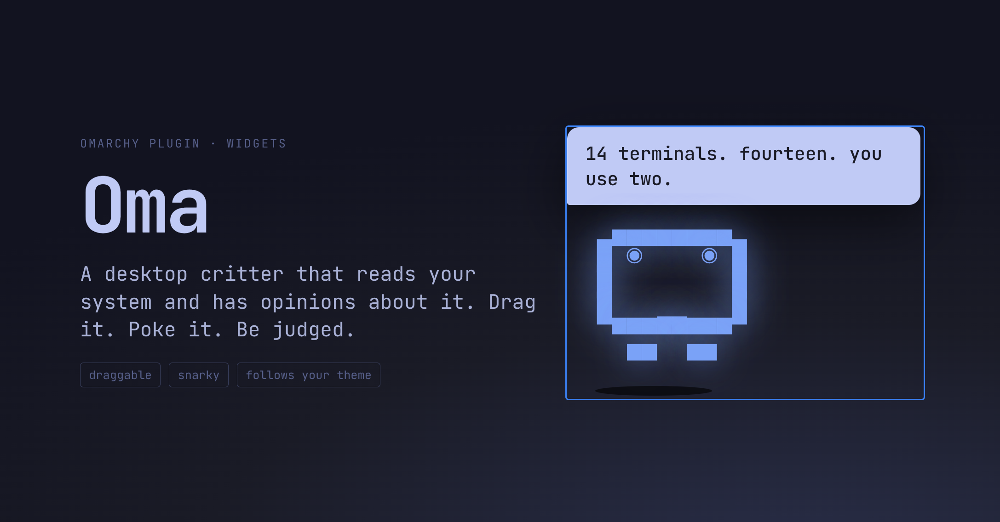

# Omabuddy

A small, mostly useless companion for [Omarchy](https://omarchy.org/). It sits
in a corner of your screen, wears your theme, and has opinions about your day.



It notices:

- **The clock.** Sleepy before eight, hyped after lunch, zen in the evening.
- **Your work streak.** Ninety minutes without a break and it starts nagging you to stand up.
- **Git.** It follows the working directory of your focused terminal. A big
  uncommitted diff makes it worry, a commit makes it proud, a push makes it
  cheer. It reads your commit subjects too: five fixes in a row, a bare
  "wip", a subject over 72 characters or one made only of emoji all get a
  look. Forty untracked files or twenty dirty lines straight on `main` earn a
  comment.
- **Your machine.** Pegged CPUs make it sweat, a low battery makes it panic,
  twenty open windows overwhelm it. Plugging in is dinner, a full battery is
  a happy sigh, unplugging is a nervous glance.
- **The calendar.** Monday mornings and Friday afternoons have their own
  lines, a push after eleven at night gets called bold, and it wears a hat
  on Halloween, New Year's Day and its own birthday (the day you installed it).
- **You leaving.** Half an hour away, or a suspend, and it greets you when you
  are back and starts the work streak fresh.
- **Achievements.** First push of the day, ten commits in a day, and a week
  without a battery panic each get a block-character confetti burst.
- **Your calendar.** If [OmaCal](https://github.com/omacal) is installed it reads
  the same feed as the OmaCal bar widget and warns you ten minutes before a meeting.
- **Your coding agents.** Omarchy already tracks Claude Code, Codex, and
  friends. The buddy knows when an agent window is spinning, when it stops
  and wants you back, and when you are about to hit a rate limit.

It comes in four shapes, all made of block characters: the original **blob**,
a **cat** that wags its tail when it's happy and ignores some of your pokes, a
**ghost** that floats above its shadow and fades when it's sleepy, and a
**bot** with a blinking antenna. Each one has a few lines of its own.

Everything it says comes from `Quips.js`, a plain list of one-liners in four
voices that you can add to: **snarky** (the default), **polite**, **cheerful**
and **deadpan**. If you run a local [Ollama](https://ollama.com/), it can
improvise instead.

## Install

```bash
omarchy plugin add https://github.com/wirlen/omabuddy.git --enable
```

Then restart the shell once so the panel mounts:

```bash
omarchy restart shell
```

## Using it

| Do this | It does |
| --- | --- |
| Click it | Pokes it. It says something. Five pokes in a minute and it sulks for 45 seconds. |
| Drag it | Moves it. It snaps to the nearest corner and remembers. |
| Scroll on it | Grows or shrinks it. The size is remembered. |
| Right-click it | Opens the settings card: pick a buddy, a voice, how chatty it is, its size and corner, and whether Ollama writes its lines. Each pick takes effect straight away and the buddy says a line about it. Click anywhere else to close the card. |
| Middle-click it | Mutes or unmutes the speech bubble. |

From a terminal or a script:

```bash
omarchy-shell omabuddy say "build is green"
omarchy-shell omabuddy poke
omarchy-shell omabuddy mood proud       # any mood name from Mood.js, for 20 seconds
omarchy-shell omabuddy celebrate tenCommits   # confetti plus that achievement's line
omarchy-shell omabuddy state            # JSON of mood, streak, and sensors
omarchy-shell omabuddy set <key> <value>   # e.g. set buddy ghost, set tone deadpan
omarchy-shell omabuddy settings         # open or close the settings card
```

That `say` call is the hook point. Wire it into anything: a git post-commit
hook, a CI notifier, an Omarchy `theme-set` hook.

## Settings

Right-click the buddy for the settings card, set a key with
`omarchy-shell omabuddy set <key> <value>`, or edit the plugin's entry in
`~/.config/omarchy/shell.json`. Changes apply immediately. The Ollama URL and
model are text, so they stay on `set`: the card never takes keyboard focus.

| Key | Default | Meaning |
| --- | --- | --- |
| `corner` | `bottom-right` | `top-left`, `top-right`, `bottom-left`, `bottom-right` |
| `size` | `14` | Face font size in pixels, 8 to 48. Scrolling on the buddy sets this too. |
| `buddy` | `blob` | `blob`, `cat`, `ghost` or `bot` |
| `tone` | `snarky` | `snarky`, `polite`, `cheerful` or `deadpan` |
| `chattiness` | `12` | Minutes between unprompted lines |
| `muted` | `false` | Hide the speech bubble |
| `llm` | `off` | `ollama` to improvise lines with a local model |
| `ollamaUrl` | `http://localhost:11434` | Where Ollama listens |
| `ollamaModel` | `llama3.2` | Any model you have pulled |
| `allowRemoteLlm` | `false` | Ollama URLs are limited to this machine unless this is `true` |
| `probeSeconds` | `20` | How often it looks at git, battery, and load |
| `installedOn` | set on first run | `YYYY-MM-DD`; the buddy's birthday |
| `stats` | written by the buddy | Today's commit and push counts and the last battery panic, for achievements |

Example entry:

```json
{ "id": "wirlen.omabuddy", "corner": "bottom-left", "llm": "ollama", "ollamaModel": "qwen2.5:3b" }
```

## Moods

`idle`, `sleepy`, `hyped`, `stretch`, `worried`, `proud`, `shipped`, `sweaty`,
`panic`, `zen`, `meeting`, `rationed`, `cooking`, `agentDone`, `poked`, `greeting`,
`welcomeBack`, `overwhelmed`, `cluttered`, `daring`, `grumpy`, `ignoring`,
`fixStreak`, `wipCommit`, `longSubject`, `emojiCommit`, `lateShip`, `plugged`,
`full`, `unplugged`, `monday`, `friday`, `birthday`, `firstPush`, `tenCommits`,
`calmWeek`. The rules live in `Mood.js`; the face for
each mood is a handful of numbers in the same file, and the costume for the
day is `Mood.costume()`. The critters themselves live in `Buddies.js`.

## Contributing lines

Open `Quips.js`, find the mood, add a line under the voice it belongs to.
Keep it short, kind, and in the voice of a small creature who lives in a
screen corner. Lines a particular critter would say (a cat, a ghost, a bot)
go in `flavor` at the bottom of the file. Tokens `{repo}`,
`{branch}`, `{dirty}`, `{hour}`, `{time}`, `{streak}`, `{battery}`, `{event}`, `{eta}`,
`{agent}`, `{prompts}`, `{limit}`, `{windows}`, `{untracked}`, `{subject}`,
`{fixes}`, `{commits}`, `{pushes}` and `{days}` are filled in.

## How it works

One `panel` plugin with `keepLoaded: true`. A fullscreen transparent layer
window on the Top layer, input-masked to the buddy so the rest of the screen
clicks through. `scripts/probe.sh` runs every few seconds and prints a JSON
snapshot of the world. `Mood.js` turns that into a mood. `Face.qml` draws the mood as block-character
text art in the shell's monospace font, glowing in a theme colour read from the
active theme's `colors.toml`. No image assets, no daemons.

Plugin code changes need `omarchy restart shell` because the panel is kept
loaded across hot-reloads.

## Status and next steps

This is a fun side project, not a product. It works, it's stable on Omarchy 4,
and it will stay small on purpose. Things that would be fun to add, roughly in
order of how likely they are to happen:

- **Faster AI replies.** Ollama answers today take a few seconds. Keep the model
  warm, stream the first line, and let a short canned reaction show while the
  real one is on its way.
- **Music.** Notice what's playing over MPRIS and comment on it. Repeat plays,
  questionable taste, and silence at 3 pm are all fair game.
- **Build and test results.** The judging face it pulls for a "wip" commit
  would suit a red build too. A `say` hook from your test runner or CI would
  light it up.
- **Notifications and system events.** Updates pending, disk nearly full,
  the theme changing under it.
- **More critters and voices.** A fifth buddy, extra moods, a per-theme
  colour override, and packs of quips in other languages.

Ideas and quips are welcome as issues or pull requests. Keep it kind, keep
it short, keep it useless. See [CONTRIBUTING.md](CONTRIBUTING.md) for the
maintainer notes, including the security and privacy rules every change has
to follow.

## Privacy and safety

- Everything runs as your user inside `omarchy-shell`, like every Omarchy plugin.
- The probe only reads: the focused window's process tree under `/proc` (to
  find your terminal's working directory), git state there (branch, change
  counts, the last commit's time and subject line, and how many of the last
  eight subjects start with "fix"), Hyprland's window
  list (the count, plus the titles of agent windows to spot a spinner),
  battery and load from sysfs, the clock, the OmaCal feed, and Omarchy's agent usage
  records. It runs git with hooks-free, config-safe flags so a freshly cloned
  repo cannot run code through its own `.git/config`.
- Nothing leaves the machine unless you set `llm` to `ollama`. Then each quip
  request posts the mood plus the fixed descriptions of the chosen buddy and
  voice (from `Buddies.js` and `Quips.js`), and a small JSON context, to
  `ollamaUrl`. Exactly these context fields:
  repo name (not the path), branch, count of uncommitted changed lines, count
  of untracked files, the last commit's subject line, the fix-streak count,
  hour of day, day of week, the time as HH:MM, minutes of your current work
  streak, battery percent, number of open windows, next calendar event title
  and minutes until it, the busiest agent's name and prompt count, the highest
  agent limit percentage, and today's commit and push counts and days since
  install from the buddy's own bookkeeping.
- The URL must be `http` or `https` and must point at this machine
  (localhost, 127.x, or ::1) unless you also set `allowRemoteLlm` to `true`.
  That guard lives in the script itself, so a stray process flipping the
  setting over IPC can't quietly turn the buddy into a beacon.
- The probe gives up after 15 seconds (its whole process group is killed 2
  seconds after that), so a stalled network mount under your terminal can't
  wedge it.
- The probe is bounded in bytes, not just time. Every name, branch, commit
  subject and event title is clipped to 128 characters, the fix-streak count
  looks at eight subject lines within 4 KiB, git listings are counted for at most
  20,000 lines, each JSON document it parses (window list, calendar feed) is
  cut off at 1 MiB, each agent usage record at 64 KiB and at most 16 records,
  files are read without following symlinks, and a snapshot over 16 KiB is
  refused by the probe and dropped again by the panel. A hostile repo or an
  oversized record costs a bounded read, never a large allocation.
- Every line it shows is rendered as plain text, never markup. That includes
  a commit subject quoted back at you.
- On its own, it writes only two keys in its own `shell.json` entry:
  `installedOn` and the `stats` counters. The settings card writes the keys
  you click (`buddy`, `tone`, `chattiness`, `muted`, `size`, `corner`, `llm`),
  and nothing else. Everything is read back as untrusted data: an unknown
  `buddy` or `tone` falls back to the default, never into the art or the
  quip tables.
- These are rules, not accidents. [CONTRIBUTING.md](CONTRIBUTING.md) spells
  out what a change may read and send, and how to report a vulnerability.

## License

MIT
